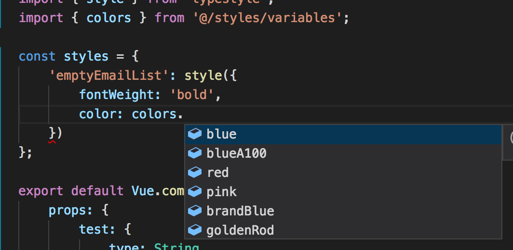

---	
templateKey: blog-post	
title: Maintainable CSS Made Easy	
date: 2017-11-19T15:04:10.000Z	
featuredpost: false	
featuredimage: /img/css-made-easy.png	
tags:	
  - CSS	
  - Typescript
  - Vuejs
  - Typestyle
  - React	
---	

CSS is amazing when you’re starting a project from the ground up. Add a little bit of classes there, a little bit of ID here, and you’re done.

…but then the app feature set starts to change, and everything begins leaking into itself. And now we have a problem, because if it’s like any of the 80,000 other apps that were released in the last year, refactoring will be impossible. At a certain point in a project’s lifecycle you can only safely “add” classes, never “remove” them.

Front-ends in particular become balls of mud very quickly if left to grow freely. Why is this? Well…

* Consistency and standards in CSS are difficult to maintain

* There are no compile-time warnings if someone doesn’t follow your CSS naming convention.

* Everything is global unless otherwise scoped
…and all it takes is one person to add “p { font-size: 1.3em;}” to ruin your entire product.

But this article isn’t a rant about the issues CSS has (there’s plenty). It’s about how to fix them by writing CSS in your Javascript.

### CSS In Your Javascript Is The Answer

#### “Separation of Concerns” Does Not Mean Separating Anything

CSS like the below example is very common:

```
/** contrived-module.css **/
.empty-list {
    display: flex;
}
.empty-list--no-users {
    background: #fafafa;
}
.empty-list--has-border {
    border: 1px solid red;
}
```

And it isn’t bad by any means… One issue with keeping everything separate is that you begin jumping through a lot of hoops to implement logic that seems simple.

For example, how can you do any of the following cleanly in CSS?

- If the total amount of items is divisible by four, display a grid of three at a a time. Otherwise, display a grid of four.

- If the component is on the left side of the screen, show a pop-out to the right of it. Otherwise, show a pop-out to the left of it.

- Allow the implementing developer to override a component’s background based on a property passed into it.
In all these cases (which are actual real-life cases I’ve had), it’s much cleaner to set and manage the style in Javascript — because you have greater access into the component -and- the browser’s context.

#### Re-Usability With Explicit Dependencies

DRY CSS is one of the most difficult things to debug, test, and develop, in part because of the language’s design. Everything is global by default. This used to be the case with Javascript, but thanks to Webpack, implementing modules is easy.

Creating reusable styles is as easy as creating a Javascript module:

```
// typography.ts
import { style } from 'typestyle';
export const headers = {
 h1: style({
  fontWeight: 'bold',
  fontSize: '30px'
 }),
 h2: style({
  fontSize: '24px'
 }),
 h3: style({
  fontSize: '20px'
 }),
 h4: style({
  fontSize: '18px'
 }),
 h5: style({
  fontSize: '16px'
 }),
 h6: style({
  fontSize: '12px'
 })
};
```

Now, without really that much work, you basically solved the core issue with CSS - your dependencies across modules are explicit. This means:

- Any module that needs to style a header like a “H1” will state it directly.

- Nobody will be able to delete “H1” if it’s used anywhere.

- If you end up changing direction and deciding to remove “H1” totally, you can see what will break.

- “H1” styles will not be applied anywhere unless explicitly requested (ACTUALLY impossible with your standard CSS rule)

#### Bonus Round: Tooling and Typescript

Try to find a good sass-variable import tool, and I will pay you cash. Instead of the overhead of creating / finding separate tooling in your IDE, CSS-in-Typescript allows you to take full advantage of Typescript’s type system to get meaningful static code analysis on your CSS for free. Since it’s just a variable, you’ll also get auto-complete for all the available styles.



Auto-complete variable names in Visual Studio Code
For most nontrivial front-end apps, CSS in Javascript is the right direction. Explicit dependencies, tooling, and access to the browser’s state make it a much safer way to scale your CSS.

To get started, I recommend reading up on Typestyle — one of the more popular Typescript CSS-in-Typescript libraries. Start slow — I would recommend adding just your basic colors as variables and applying them to smaller components. Do not rewrite, just slowly add.

In case you disagree with everything above, but still want to avoid global CSS: look into CSS modules — they are verbose, but another great option for avoiding global CSS. There will definitely be an article on them here in the future.

Thank you for reading the Front-End Society Blog! Hop on this train early & bookmark our site. Additionally, you can follow me on Twitter.
